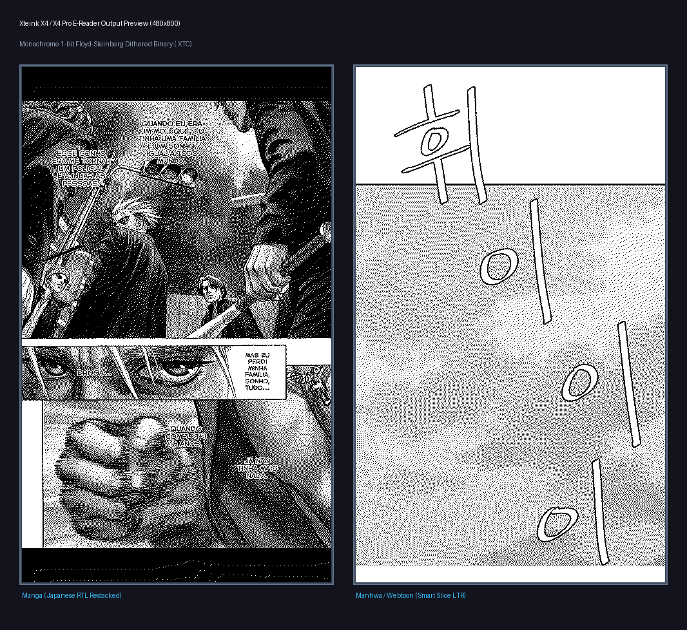

# Xteink X4 / X4 Pro - Manga & Manhwa XTC Converter

[](https://www.python.org/downloads/)
[](LICENSE)
[](# specifications--especificações)
[](#-vibe-coding-disclaimer--aviso-de-vibe-coding)

> **English:** High-performance Python tool & Desktop GUI for converting Manga and Manhwa/Webtoon CBZ files into optimized binary `.XTC` format for **Xteink X4** & **X4 Pro** e-ink readers (480x800 resolution).  
> **Português (PT-BR):** Ferramenta Python de alta performance e Interface Gráfica Desktop para converter arquivos CBZ de Mangá e Manhwa/Webtoon no formato binário `.XTC` otimizado para leitores e-ink **Xteink X4** e **X4 Pro** (resolução 480x800).

---

## ⚠️ Vibe Coding Disclaimer / Aviso de Vibe Coding

> **EN:** ⚡ **Notice:** This project was **Vibe Coded** (developed iteratively with AI pair-programming assistance). It is fully functional, tailored specifically for Xteink e-ink hardware specifications, and provided as-is. Feel free to open issues or contribute!  
>  
> **PT-BR:** ⚡ **Aviso:** Este projeto foi totalmente **Vibe Codado** (desenvolvido com o auxílio de inteligência artificial em tempo real). Ele é 100% funcional, calibrado sob medida para o hardware e a tela do Xteink X4/X4 Pro, e oferecido "como está". Sinta-se livre para abrir issues ou enviar contribuições!

---

## 🖼 Output Examples / Exemplo de Resultado no Xteink X4 (480x800)



<p align="center">
  
  &nbsp;&nbsp;&nbsp;&nbsp;
  
</p>

---

## 📖 How It Works / Como Funciona

### English

The **Xteink X4 / X4 Pro** uses a 480x800 1-bit monochrome e-ink display requiring raw binary `.XTC` container files with a strict 56-byte binary header. Standard image converters often clip dialogue bubbles, distort aspect ratios, or render illegible small text. This toolkit provides specialized algorithms for both Japanese Manga and Korean Manhwa:

1. **`manga2xtc.py` (Manga Processor):**
   - **Single-Page Vertical Re-Stacking:** Automatically detects panel row boundaries, crops empty vertical whitespace between panel rows, and restacks them vertically on the 480x800 canvas.
   - **Japanese RTL Order:** Handles Right-to-Left double-page spreads by splitting them into right-half first, then left-half.
   - **Zero-Crop Aspect Scaling:** Ensures 0% text clipping by adaptive padding instead of aggressive cropping.
   - **Cover & Splash Protection:** Preserves full 480x800 single-page splash art and cover renders without panel splitting.
   - **Unsharp Masking & Lanczos4 Resampling:** Enhances contrast and sharpens 6–8pt font letterings for crisp e-ink legibility.

2. **`manhwa2xtc.py` (Manhwa/Webtoon Slicer):**
   - **Smart Contour Text Protection:** Detects speech bubbles and dialogue text using computer vision contour analysis, enforcing safety top/bottom headroom buffers to prevent cutting through text.
   - **Top-Margin Pullback:** Eliminates top-edge dialogue clipping when starting new vertical slices.
   - **Adaptive Canvas Background Matching:** Dynamically measures margin color variance to fill letterbox bars seamlessly without harsh black/white blocks.
   - **Continuous Strip Slicing:** Assembles webtoon images into a continuous vertical strip before performing intelligent slicing into 480x800 e-ink pages.

3. **`gui_converter.py` (Desktop GUI & Real-Time Preview):**
   - Modern dark-mode interface built with `CustomTkinter`.
   - **Live Visual Slice Preview:** View real-time dithered page previews before processing the entire folder.
   - **Batch & Single File Mode:** Convert individual `.cbz` files or entire directories recursively.
   - Progress bar, status logs, and customizable target directory selection.

---

### Português (PT-BR)

O **Xteink X4 / X4 Pro** possui uma tela e-ink monocromática de 480x800 pixels que lê arquivos binários no formato proprietário `.XTC` (com cabeçalho estrito de 56 bytes). Conversores comuns costumam cortar balões de fala, distorcer a proporção ou deixar textos pequenos ilegíveis. Este programa resolve isso com algoritmos específicos:

1. **`manga2xtc.py` (Processador de Mangá):**
   - **Reorganização Vertical de Painéis (Restacking):** Identifica as linhas de quadros, remove espaços em branco inúteis entre as linhas e empilha os quadros verticalmente na tela de 480x800.
   - **Ordem de Leitura Oriental (RTL):** Trata páginas duplas dividindo-as automaticamente da direita para a esquerda.
   - **Preservação Zero-Crop:** Proporção ajustada perfeitamente garantindo 0% de corte em balões de fala ou artes.
   - **Proteção de Capas e Splash Pages:** Detecta automaticamente capas e páginas duplas épicas e mantém a renderização vertical completa sem fatiar.
   - **Filtros de Nitidez e Resampling Lanczos4:** Aplica Unsharp Mask e autocontraste para deixar fontes pequenas de 6–8pt perfeitamente legíveis na tela e-ink.

2. **`manhwa2xtc.py` (Fatiador de Manhwa/Webtoon):**
   - **Proteção Inteligente de Balões de Fala:** Usa visão computacional (OpenCV) para detectar balões de diálogo e aplica margens de segurança para nunca cortar um texto ao meio.
   - **Recuo de Margem Superior:** Evita cortes no topo do texto no início de cada nova página.
   - **Fundo Adaptativo:** Mede a cor das margens e preenche o espaço restante de forma uniforme, evitando barras pretas ou brancas indesejadas.
   - **Fatiamento de Tira Contínua:** Junta as imagens do webtoon em uma tira vertical única antes de realizar os cortes inteligentes de 480x800.

3. **`gui_converter.py` (Interface Gráfica com Preview em Tempo Real):**
   - Interface moderna em Dark Mode construída com `CustomTkinter`.
   - **Visualização ao Vivo:** Veja como a página fatiada e pontilhada (dithered) vai ficar no Xteink antes de converter a pasta inteira.
   - **Modo Lote ou Arquivo Único:** Converta um arquivo `.cbz` isolado ou pastas inteiras com subpastas.
   - Barra de progresso, logs detalhados e seleção personalizada da pasta de saída.

---

## 🛠 Specifications / Especificações

| Property / Propriedade | Specification / Especificação |
| :--- | :--- |
| **Supported OS / SOs Suportados** | **Windows** (10 / 11), **Linux** (Ubuntu, Arch, Debian, Fedora, etc.), **macOS** (Intel & Apple Silicon) |
| **Python Version** | Python **3.8+** (Recommended: **3.10 / 3.11 / 3.12**) |
| **Target Hardware** | Xteink X4 / X4 Pro (E-ink Display 480x800) |
| **Output Format** | Binary `.XTC` (56-byte header, 1-bit Floyd-Steinberg dithered XTG pages) |
| **Input Format** | Comic Book Archive (`.cbz` containing PNG, JPG, WEBP, BMP) |
| **Core Libraries** | `CustomTkinter`, `Pillow` (PIL), `opencv-python`, `numpy` |

---

## 🚀 Installation & Setup / Instalação

### Prerequisites / Pré-requisitos
Ensure you have Python 3.8 or higher installed on your system.

#### 🪟 Windows Setup

1. **Open Command Prompt or PowerShell** in the project folder.
2. **Create and activate a Virtual Environment:**
   ```cmd
   python -m venv .venv
   .venv\Scripts\activate
   ```
3. **Install dependencies:**
   ```cmd
   pip install -r requirements.txt
   ```
4. **Run the Graphical App (GUI):**
   ```cmd
   python gui_converter.py
   ```

---

#### 🐧 Linux Setup

1. **Open your Terminal** in the project directory.
2. **Make the launcher script executable and run it:**
   ```bash
   chmod +x run_gui.sh
   ./run_gui.sh
   ```
   *Or set up manually:*
   ```bash
   python3 -m venv .venv
   source .venv/bin/activate
   pip install -r requirements.txt
   python3 gui_converter.py
   ```

---

#### 🍏 macOS Setup (Intel & Apple Silicon)

1. **Open Terminal** in the project folder.
2. **Create and activate virtual environment:**
   ```bash
   python3 -m venv .venv
   source .venv/bin/activate
   ```
3. **Install required packages:**
   ```bash
   pip install -r requirements.txt
   ```
4. **Launch the application:**
   ```bash
   python3 gui_converter.py
   ```

---

## 🖥 Command Line Interface (CLI) Usage / Uso via Terminal

If you prefer processing files via command line or scripts without GUI:

### Manga Conversion (`manga2xtc.py`)
```bash
# Process a single CBZ file
python manga2xtc.py "path/to/manga_chapter.cbz" -o "path/to/output_dir"

# Process an entire folder of CBZ files
python manga2xtc.py "path/to/manga_folder/" -o "path/to/output_dir"
```

### Manhwa Conversion (`manhwa2xtc.py`)
```bash
# Process a single Webtoon/Manhwa CBZ file
python manhwa2xtc.py "path/to/manhwa_chapter.cbz" -o "path/to/output_dir"

# Process a folder of Manhwa CBZ files
python manhwa2xtc.py "path/to/manhwa_folder/" -o "path/to/output_dir"
```

---

## 📜 License

This project is open-source under the [MIT License](LICENSE).
